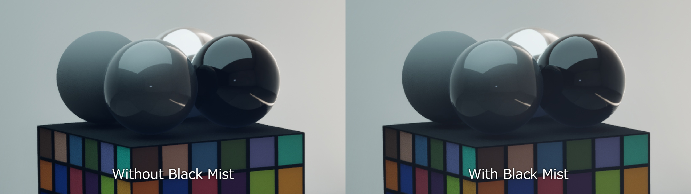
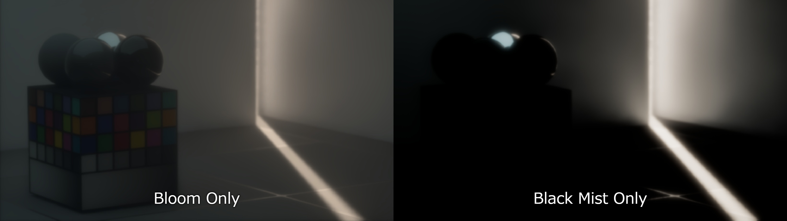
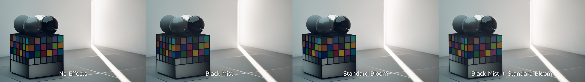

# Black Mist for Unreal Engine

Black Mist is a runtime Unreal Engine plugin that adds a pre-tonemap HDR diffusion post effect through `SceneViewExtension`, Global Shaders, and Render Dependency Graph screen passes.

The effect is intended to behave more like optical black mist filtration than ordinary additive bloom: highlights spread across multiple scales, the bright core is gently reduced, contrast is compressed slightly, and scene alpha is preserved.



## Features

- Runtime plugin, no Engine source modifications.
- `FWorldSceneViewExtension` integration managed by a `UWorldSubsystem`.
- Scene-linear HDR processing before tonemapping.
- Fixed 8-pass high-quality diffusion pyramid:
  1. `BlackMist.PrefilterHalf`
  2. `BlackMist.DownsampleQuarter`
  3. `BlackMist.DownsampleEighth`
  4. `BlackMist.DownsampleSixteenth`
  5. `BlackMist.UpsampleEighth`
  6. `BlackMist.UpsampleQuarter`
  7. `BlackMist.UpsampleHalf`
  8. `BlackMist.Composite`
- Zero Black Mist RDG passes when disabled or intensity is zero.
- ViewRect-aware screen pass sampling and `OverrideOutput` support.
- Blueprint callable setup through `UBlackMistBlueprintLibrary`.
- Debug views for mask, pyramid levels, accumulated halo, core loss, and halo only.

## Comparisons





## Requirements

- Unreal Engine 5.7 was used for implementation and validation.
- Desktop SM5/SM6 rendering path.
- The plugin is not validated for mobile, path tracing, or tiled Movie Render Queue output.

## Repository Layout

This repository is laid out as an Unreal plugin root:

```text
BlackMist.uplugin
Docs/
Shaders/
Source/
  BlackMistRuntime/
```

Clone or copy this repository as the plugin directory, usually `YourProject/Plugins/BlackMist`.

## Installation

Copy or clone this repository into your Unreal project:

```text
YourProject/
  Plugins/
    BlackMist/
```

Then regenerate project files if needed and build the project. The plugin module uses `PostConfigInit` so shader directory mapping is registered early enough for Global Shader compilation.

You can also reference this repository through `AdditionalPluginDirectories` in a `.uproject`.

To package the plugin:

```text
Engine/Build/BatchFiles/RunUAT.bat BuildPlugin -Plugin="Path/To/BlackMist/BlackMist.uplugin" -Package="Path/To/Package/BlackMist" -TargetPlatforms=Win64 -Rocket
```

## Usage

Open Project Settings and edit:

```text
Project Settings > Plugins > Black Mist
```

`Default Settings` is applied when each world creates its `UBlackMistSubsystem`. In the editor, changing the Project Settings entry also pushes the new defaults into existing Black Mist subsystems.

Each Black Mist parameter row has a reset arrow when its value differs from the plugin default.

Settings can still be changed at runtime from Blueprint through:

- `SetBlackMistSettings`
- `GetBlackMistSettings`
- `SetBlackMistEnabled`
- `ResetBlackMistToProjectDefaults`
- `ResetBlackMistToPluginDefaults`

C++ example:

```cpp
if (UBlackMistSubsystem* BlackMist = World->GetSubsystem<UBlackMistSubsystem>())
{
	FBlackMistSettings Settings = BlackMist->GetSettings();
	Settings.Intensity = 0.45f;
	Settings.Threshold = 1.0f;
	Settings.HaloStrength = 0.75f;
	BlackMist->SetSettings(Settings);
}
```

Useful console variables:

```text
r.BlackMist.Enable 1
r.BlackMist.Debug -1
r.BlackMist.IntermediateFormat 1
r.BlackMist.ForcePassLocation 0
```

`r.BlackMist.Debug` values:

```text
-1 use subsystem setting
 0 final
 1 scatter mask
 2 half prefilter
 3 quarter downsample
 4 eighth downsample
 5 sixteenth downsample
 6 accumulated halo
 7 core loss only
 8 halo only
```

## Rendering Notes

The default post-process subscription point is `EPostProcessingPass::MotionBlur`, which maps to a pre-tonemap scene color slot before built-in bloom in UE 5.7. Set `r.BlackMist.ForcePassLocation=1` to test the `AfterDOF` location.

The shaders include Engine shader headers by virtual path and do not copy Engine shader source into this repository.

## Validation Status

The implementation has been checked against UE 5.7.4:

- `RunUAT BuildPlugin` succeeded for Win64 Editor Development, Development Game, and Shipping compile.
- The consuming project mounted the plugin and reached Engine initialization without the earlier `Common.ush` shader include failure.
- Project Settings integration compiles through UHT and all BuildPlugin target configurations.
- Project Settings reset arrows are provided by the editor-only `BlackMistEditor` module.

The following still need project-side validation:

- Editor viewport, PIE, and Standalone visual behavior.
- `profilegpu`, `stat gpu`, and `DumpGPU` verification of pass extents and timings.
- Split-screen, dynamic resolution, TSR/AA matrix, SceneCapture, and MRQ behavior.

## Documentation

- [Implementation plan](Docs/BlackMist/IMPLEMENTATION_PLAN.md)
- [Acceptance checklist](Docs/BlackMist/ACCEPTANCE_CHECKLIST.md)
- [Implementation status](Docs/BlackMist/IMPLEMENTATION_STATUS.md)
- [License review](Docs/BlackMist/LICENSE_REVIEW.md)
- [Third-party notices](THIRD_PARTY_NOTICES.md)

## License

MIT License. See [LICENSE](LICENSE).

Unreal Engine is not included in this repository and is licensed separately by Epic Games. Users need their own Unreal Engine license to build or run the plugin.
