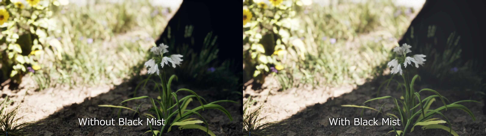
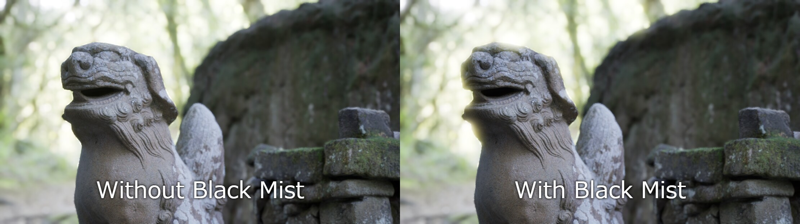
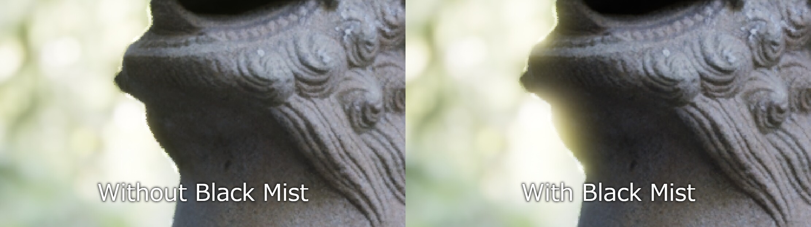
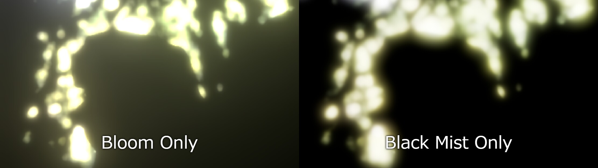
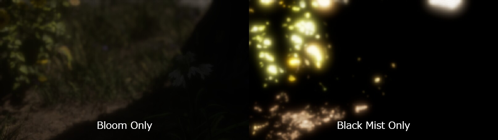

# Black Mist for Unreal Engine

Black Mist is a runtime Unreal Engine plugin that adds a pre-tonemap HDR diffusion post effect through `SceneViewExtension`, Global Shaders, and Render Dependency Graph screen passes.

The effect is intended to behave more like optical black mist filtration than ordinary additive bloom: highlights spread across multiple scales, the bright core is gently reduced, contrast is compressed slightly, and scene alpha is preserved.



## Features

- Runtime plugin, no Engine source modifications.
- `FWorldSceneViewExtension` integration managed by a `UWorldSubsystem`.
- Scene-linear HDR processing before tonemapping.
- Fixed 8-pass high-quality diffusion pyramid:
  1. `BlackMist.PrefilterHalf`
  2. `BlackMist.DownsampleQuarter`
  3. `BlackMist.DownsampleEighth`
  4. `BlackMist.DownsampleSixteenth`
  5. `BlackMist.UpsampleEighth`
  6. `BlackMist.UpsampleQuarter`
  7. `BlackMist.UpsampleHalf`
  8. `BlackMist.Composite`
- Zero Black Mist RDG passes when disabled or intensity is zero.
- Continuous `Intensity` control: `0..1` blends from untouched scene color to the unit effect, while `1..2` overdrives halo/core removal.
- Per-tap prefilter thresholding and soft anti-firefly limiting before downsample averaging.
- Shared scatter source for diffused halo and highlight core removal.
- Adjustable diffusion radius, wide-tail weighting, base scatter, and saturated-emitter detection.
- Separate final/debug composite shaders so normal final output does not bind debug-only D1-D4 resources.
- ViewRect-aware screen pass sampling and `OverrideOutput` support.
- Blueprint callable setup through `UBlackMistBlueprintLibrary`.
- Debug views for mask, pyramid levels, accumulated halo, core loss, and halo only.

## Comparisons

These captures show the effect in a high dynamic range outdoor scene, including Path Tracing view mode. Black Mist spreads overexposed highlights into a soft veil, slightly lifts the darkest regions, and keeps foreground detail readable.



_Full-scene comparison: the background highlights diffuse across the stone silhouette without replacing the underlying scene color._



_Close-up comparison: the halo is most visible around bright high-contrast edges._





_The `Black Mist Only` views show the isolated diffusion contribution. Black regions are areas where the pass adds little or no haze._


## Requirements

- Unreal Engine 5.7.4 and 5.8.0 were used for Win64 package validation.
- Desktop SM5/SM6 rendering path.
- The plugin is not validated for mobile or tiled Movie Render Queue output.

## Repository Layout

This repository is laid out as an Unreal plugin root:

```text
BlackMist.uplugin
Docs/
Shaders/
Source/
  BlackMistEditor/
  BlackMistRuntime/
```

Clone or copy this repository as the plugin directory, usually `YourProject/Plugins/BlackMist`.

## Installation

Copy or clone this repository into your Unreal project:

```text
YourProject/
  Plugins/
    BlackMist/
```

Then regenerate project files if needed and build the project. The plugin module uses `PostConfigInit` so shader directory mapping is registered early enough for Global Shader compilation.

You can also reference this repository through `AdditionalPluginDirectories` in a `.uproject`.

To package the plugin:

```text
Engine/Build/BatchFiles/RunUAT.bat BuildPlugin -Plugin="Path/To/BlackMist/BlackMist.uplugin" -Package="Path/To/Package/BlackMist" -TargetPlatforms=Win64 -Rocket
```

## Usage

Open Project Settings and edit:

```text
Project Settings > Plugins > Black Mist
```

`Default Settings` is applied when each world creates its `UBlackMistSubsystem`. In the editor, changing the Project Settings entry also pushes the new defaults into existing Black Mist subsystems.

Each Black Mist parameter row has a reset arrow when its value differs from the plugin default.

`Affect Path Tracing` is enabled by default so the effect can run in Path Tracing view modes. Disable it if a project needs path-traced reference output without Black Mist.

Key parameter semantics:

- `Intensity`: `0.0` is identity and standard activation creates no Black Mist passes; `0.0..1.0` blends in the complete unit effect; `1.0..2.0` keeps the unit blend and overdrives halo/core removal.
- `ScatterAmount`: fraction of scene radiance entering the diffusion source. It drives both the halo pyramid source and direct highlight removal.
- `CoreLoss`: removes radiance from the same scatter source used by the halo, rather than darkening all highlighted color independently.
- `HaloStrength` and `HaloTint`: artistic gain and tint applied to the accumulated scatter halo. Values above physically neutral settings can add energy.
- `DiffusionRadius`: widens or tightens kernels without changing the fixed eight-pass graph.
- `WideTail`: shifts normalized level weights toward the far pyramid levels for longer veiling glare. Custom `ScaleWeights` still override the derived weights and are normalized.
- `BaseScatter`: low-level scatter floor, clamped to `0.0..0.05`; the default is zero.
- `ScatterMetric`: perceptual luminance, peak channel, or hybrid detection for saturated emitters.
- `ChromaSensitivity`: contribution of peak-channel detection in hybrid mode.
- `LocalVeilingStrength`: controls local shadow lift from the mist veil. `Contrast` uses its own local mask derived from the actual halo/core-loss energy, so it remains responsive without grading untouched parts of the frame.

Settings can still be changed at runtime from Blueprint through:

- `SetBlackMistSettings`
- `GetBlackMistSettings`
- `SetBlackMistEnabled`
- `ResetBlackMistToProjectDefaults`
- `ResetBlackMistToPluginDefaults`

C++ example:

```cpp
if (UBlackMistSubsystem* BlackMist = World->GetSubsystem<UBlackMistSubsystem>())
{
	FBlackMistSettings Settings = BlackMist->GetSettings();
	Settings.Intensity = 0.45f;
	Settings.Threshold = 1.0f;
	Settings.HaloStrength = 0.75f;
	BlackMist->SetSettings(Settings);
}
```

Useful console variables:

```text
r.BlackMist.Enable 1
r.BlackMist.Debug -1
r.BlackMist.IntermediateFormat 0
r.BlackMist.CompositeFilter 1
r.BlackMist.ForcePassLocation 0
```

`r.BlackMist.IntermediateFormat` values:

```text
0 Auto: use R11G11B10F only when the RHI reports Texture2D, TextureSample, and RenderTarget support; otherwise RGBA16F
1 RGBA16F
2 R11G11B10F
```

`r.BlackMist.CompositeFilter` values:

```text
0 one bilinear sample
1 four-tap bilinear tent default
2 nine-tap reference
```

`r.BlackMist.Debug` values:

```text
-1 use subsystem setting
 0 final
 1 scatter mask
 2 half prefilter
 3 quarter downsample
 4 eighth downsample
 5 sixteenth downsample
 6 accumulated halo
 7 core loss only removed energy
 8 halo only
```

## Rendering Notes

The default post-process subscription point is `EPostProcessingPass::MotionBlur`, which maps to a pre-tonemap scene color slot before built-in bloom in UE 5.7/5.8. Set `r.BlackMist.ForcePassLocation=1` to test the `AfterDOF` location.

The shaders include Engine shader headers by virtual path and do not copy Engine shader source into this repository.

## Validation Status

The implementation has been checked against UE 5.7.4 and UE 5.8.0 on 2026-06-23:

- `RunUAT BuildPlugin` succeeded for Win64 `UnrealEditor Development`, `UnrealGame Development`, and `UnrealGame Shipping` on UE 5.7.4 and UE 5.8.0.
- `Plugins.BlackMist.Settings.Sanitization` automation test passed under `UnrealEditor-Cmd -NullRHI` on UE 5.7.4 and UE 5.8.0.
- UHT completed with warnings as errors in both engine versions.
- Project Settings integration and reset-arrow customization compile through the editor module.
- Path Tracing view modes are not skipped when `Affect Path Tracing` is enabled.

The following still need project-side validation:

- Shader compilation on the final target RHI outside `-NullRHI`.
- Editor viewport, PIE, Standalone, and Path Tracing visual behavior.
- `profilegpu`, `stat gpu`, and `DumpGPU` verification of pass extents and timings.
- Split-screen, dynamic resolution, TSR/AA matrix, SceneCapture, and MRQ behavior.

## Documentation

- [Implementation plan](Docs/BlackMist/IMPLEMENTATION_PLAN.md)
- [Acceptance checklist](Docs/BlackMist/ACCEPTANCE_CHECKLIST.md)
- [Implementation status](Docs/BlackMist/IMPLEMENTATION_STATUS.md)
- [Quality upgrade status](Docs/BlackMist/QUALITY_UPGRADE_STATUS.md)
- [Quality validation matrix](Docs/BlackMist/QUALITY_VALIDATION_MATRIX.md)
- [License review](Docs/BlackMist/LICENSE_REVIEW.md)
- [Third-party notices](THIRD_PARTY_NOTICES.md)

## License

MIT License. See [LICENSE](LICENSE).

Unreal Engine is not included in this repository and is licensed separately by Epic Games. Users need their own Unreal Engine license to build or run the plugin.
